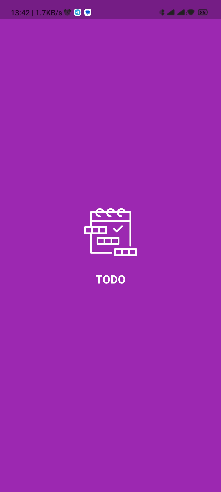
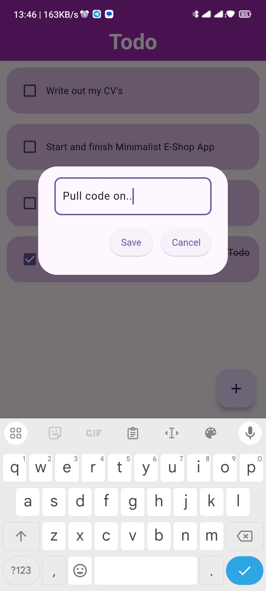

# Todo App

A simple and intuitive Todo application built using Flutter.
This app allows users to manage their daily tasks efficiently.

## Features

- **Task Management**: Add, delete, and mark tasks as completed.
- **Offline Support**: Access tasks without an internet connection.


## Screenshots

<p align="center">
  
  
  
  
</p>


## Getting Started

A few resources to get you started if this is your first Flutter project:

- [Lab: Write your first Flutter app](https://docs.flutter.dev/get-started/codelab)
- [Cookbook: Useful Flutter samples](https://docs.flutter.dev/cookbook)

For help getting started with Flutter development, view the
[online documentation](https://docs.flutter.dev/), which offers tutorials,
samples, guidance on mobile development, and a full API reference.

### Prerequisites

- Flutter SDK: [Install Flutter](https://flutter.dev/docs/get-started/install)
- A code editor (VS Code, Android Studio, etc.)

### Installation

1. **Clone the repository:**
    ```bash
    git clone https://github.com/yourusername/todo-app.git
    cd todo-app
    ```

2. **Install dependencies:**
    ```bash
    flutter pub get
    ```

3. **Run the app:**
    ```bash
    flutter run
    ```

## Project Structure

lib/
|- Database/ # Data models
|- screens/ # UI screens
|- util/ # Reusable widgets
|- main.dart # Entry point of the app


## Contributing

Contributions are welcome! Please open an issue or submit a pull request.

### Steps to Contribute

1. Fork the repository.
2. Create a new branch: `git checkout -b feature-branch-name`.
3. Make your changes.
4. Commit your changes: `git commit -m 'Add some feature'`.
5. Push to the branch: `git push origin feature-branch-name`.
6. Open a pull request.


## Acknowledgements
- [Ihim Arinze] for inspiration and guidance.
